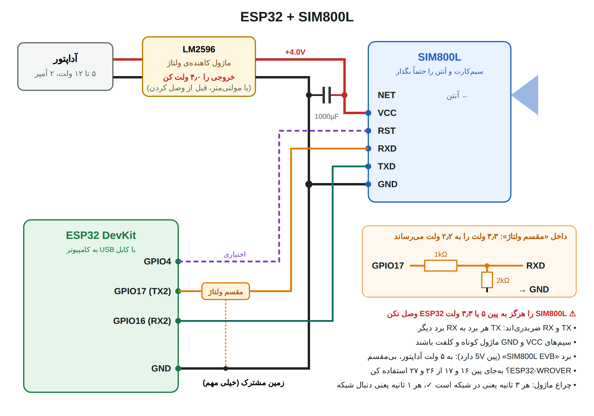

# ESP32 + SIM800: راهنمای قدم‌به‌قدم، از صفر تا صد

هدف: هر پیامکی که روی سیم‌کارت می‌آید (واریز، برداشت، رمز پویا) خودکار به کامپیوترت برسد.

دو برنامه داری و **به ترتیب** از آن‌ها استفاده کن:

| برنامه | کارش | کی |
|---|---|---|
| `sim800_test/sim800_test.ino` | آزمایش ماژول قدم‌به‌قدم؛ پیامک‌ها را فارسی در Serial Monitor نشان می‌دهد. وای‌فای و کامپیوتر لازم ندارد. | اول |
| `gprs_forwarder/gprs_forwarder.ino` | **کاملاً خودکار:** با اینترنت سیم‌کارت، پیامک را به برنامه‌ی حسابداری روی **هاست** می‌فرستد؛ آن‌جا «بابت چی بود؟» در بله پرسیده و ثبت می‌شود. | پیشنهادی، اگر هاست داری |
| `bale_direct/bale_direct.ino` | **بدون کامپیوتر و وای‌فای:** با اینترنت خود سیم‌کارت، پیامک‌های بانک را مستقیم به ربات بله می‌فرستد. | وقتی تست کامل جواب داد (راه ساده) |
| `sms_forwarder/sms_forwarder.ino` | با وای‌فای پیامک‌ها را به برنامه‌ی کامپیوتر می‌فرستد (حسابداری، اشخاص، مغایرت). | اگر بخش حسابداری را می‌خواهی |



---

## مرحله ۰: خرید

| قطعه | توضیح |
|---|---|
| ESP32 DevKit (WROOM-32) | همان که داری |
| ماژول SIM800L | همان که داری، **با آنتن** (فنری یا سیم‌دار) |
| ماژول کاهنده‌ی ولتاژ **LM2596** | برای ساختن ۴ ولت از آداپتور |
| آداپتور ۵ تا ۱۲ ولت، **حداقل ۲ آمپر** | آداپتور ۹ یا ۱۲ ولت مودم قدیمی هم خوب است |
| خازن الکترولیتی ۱۰۰۰ میکروفاراد، ۱۶ ولت | برای جلوگیری از افت ولتاژ لحظه‌ای |
| مقاومت ۱ کیلو و ۲ کیلو (یا دو ۱ کیلوی سری) | مقسم ولتاژ |
| مولتی‌متر | برای تنظیم ۴ ولت **حیاتی است** |
| سیم جامپر، برد بورد، کابل USB دیتا | کابل باید دیتا باشد، نه فقط شارژ |
| سیم‌کارت | همان که پیامک بانک رویش می‌آید؛ **PIN آن را خاموش کن** |

> 🔋 به‌جای آداپتور و LM2596 می‌توانی یک **باتری لیتیومی 18650** شارژشده (۳٫۷ تا ۴٫۲ ولت) مستقیم به ماژول بدهی. برای تست عالی است، ولی برای کار دائمی، آداپتور و LM2596 بهتر است.

## مرحله ۱: آماده کردن کامپیوتر (۱۵ دقیقه)

1. [Arduino IDE 2](https://www.arduino.cc/en/software) را نصب کن.
2. پشتیبانی ESP32: File ← Preferences ← در «Additional boards manager URLs» این را بگذار:
   ```
   https://espressif.github.io/arduino-esp32/package_esp32_index.json
   ```
   بعد Tools ← Board ← Boards Manager ← `esp32` (از Espressif) را **Install** کن.
3. ESP32 را با USB وصل کن. در Tools ← Port باید یک پورت جدید ببینی (مثلاً COM3).
   اگر پورتی نیامد، درایور **CP210x** یا **CH340** را نصب کن (روی تراشه‌ی کنار USB برد نوشته شده کدام است).
4. **فقط ESP32، بدون ماژول:** پوشه‌ی `sim800_test` را باز کن و `sim800_test.ino` را با Arduino IDE باز کن.
   Tools ← Board ← **ESP32 Dev Module** ← **Upload**.
   اگر آپلود با «Connecting…» گیر کرد، دکمه‌ی **BOOT** روی ESP32 را نگه دار تا شروع شود.
5. Tools ← Serial Monitor ← سرعت **115200**. چون هنوز ماژولی وصل نیست باید بنویسد:
   `FAIL: no answer from the modem` ✅ یعنی ESP32 و آپلود سالم است.

## مرحله ۲: تغذیه‌ی SIM800 (مهم‌ترین مرحله)

ماژول SIM800L با **۳٫۴ تا ۴٫۴ ولت** کار می‌کند و موقع ارتباط با دکل **تا ۲ آمپر** جریان لحظه‌ای می‌کشد. بیشتر مشکلات SIM800 از همین است.

1. آداپتور را به **ورودی** LM2596 وصل کن (IN+ و IN−). **هنوز به ماژول وصل نکن.**
2. مولتی‌متر را روی خروجی (OUT+ و OUT−) بگذار و پیچ آبی را بچرخان تا **۴٫۰ ولت** شود.
3. آداپتور را جدا کن. حالا OUT+ را به **VCC** ماژول و OUT− را به **GND** ماژول وصل کن.
   خازن ۱۰۰۰ میکروفاراد را هم نزدیک ماژول بین VCC و GND بگذار. **پایه‌ی بلند (+) به VCC.**
4. **آنتن** را به NET وصل کن و سیم‌کارت را بگذار (طرف طلایی رو به برد، گوشه‌ی بریده طبق شکل روی برد).
5. آداپتور را وصل کن و به چراغ ماژول نگاه کن:

| چراغ | معنی |
|---|---|
| خاموش | برق نمی‌رسد؛ سیم‌کشی و ولتاژ را چک کن |
| هر **۱ ثانیه** یک چشمک | روشن است و دنبال شبکه می‌گردد (۱۰ تا ۳۰ ثانیه صبر کن) |
| هر **۳ ثانیه** یک چشمک | ✅ در شبکه ثبت شد |
| چند چشمک و بعد خاموش، دوباره از اول | ❌ تغذیه ضعیف است (آداپتور ضعیف، سیم نازک، خازن نداری) |

> ⚠️ SIM800L را **هرگز** به پین ۵V یا ۳٫۳V برد ESP32 وصل نکن. با ۵ ولت می‌سوزد، و با ۳٫۳ ولت مدام خاموش می‌شود.
>
> اگر برد تو قرمز بزرگ با نام **SIM800L EVB** و پین **5V** است، رگولاتور و مبدل سطح دارد: آن را به ۵ ولت (همان آداپتور ۵ ولت ۲ آمپر) وصل کن و مقسم ولتاژ هم لازم ندارد.

## مرحله ۳: وصل کردن به ESP32

طبق شکل بالا:

| SIM800L | ESP32 | توضیح |
|---|---|---|
| TXD | GPIO16 | مستقیم |
| RXD | GPIO17 | از طریق **مقسم ولتاژ**: GPIO17 ← مقاومت ۱k ← RXD، و از همان نقطه‌ی RXD یک مقاومت ۲k به GND |
| GND | GND | **زمین مشترک**: GND ماژول، GND خروجی LM2596 و GND برد ESP32 همه به هم وصل باشند |
| RST | GPIO4 | اختیاری؛ ESP32 در صورت هنگ کردن ماژول آن را ری‌استارت می‌کند |
| VCC | فقط LM2596 (۴ ولت) | **به ESP32 وصل نمی‌شود** |

ESP32 را با همان کابل USB به کامپیوتر وصل نگه دار.

> چرا مقسم ولتاژ؟ پایه‌های SIM800 برای ۲٫۸ ولت ساخته شده‌اند و ESP32 با ۳٫۳ ولت حرف می‌زند. خیلی‌ها بدون مقسم هم وصل می‌کنند و کار می‌کند، ولی با مقسم مطمئن‌تر است و ماژول را اذیت نمی‌کند.
>
> اگر ESP32-WROVER داری (روی تراشه‌اش WROVER نوشته شده)، پایه‌های ۱۶ و ۱۷ آن آزاد نیستند. از ۲۶ و ۲۷ استفاده کن و در بالای هر دو برنامه `MODEM_RX_PIN = 26` و `MODEM_TX_PIN = 27` بگذار.

## مرحله ۴: تست کامل ماژول

دکمه‌ی **EN/RST** روی ESP32 را بزن، یا دوباره Upload کن، و Serial Monitor را باز کن. خروجی سالم این‌طور است:

```
---- 1. Modem ----
OK: modem answers at 9600 baud
Model: SIM800 R14.18

---- 2. Power, SIM card, network ----
Supply voltage: 4.01 V  (good)
SIM: +CPIN: READY
Network: registered (home)
Operator: +COPS: 0,0,"IR-MCI"
Signal: 18/31 (-77 dBm) good

---- 3. SMS ----
SMS stored on the SIM: 1
[SMS #2] from: BANK MELLAT   time: 26/10/01,10:15:40+14
بانک ملت
واریز:5,000,000
...
READY. Send an SMS to this SIM from your phone
```

حالا:
1. از گوشی خودت یک پیامک فارسی به این سیم‌کارت بفرست. باید چند ثانیه بعد در Serial Monitor ظاهر شود. ✅
2. صبر کن تا یک **پیامک بانک** بیاید. مقدار `from:` آن را یادداشت کن؛ این **شناسه‌ی فرستنده‌ی بانک** است و بعداً در تنظیمات اپ تیکش می‌زنی.
3. می‌توانی در کادر بالای Serial Monitor دستور هم بنویسی، مثلاً `AT+CSQ` برای قدرت آنتن.

اگر چیزی خطا داد، برو سراغ **جدول عیب‌یابی** پایین صفحه.

## مرحله ۵ (راه خودکار): به هاست، با اینترنت سیم‌کارت ☁️

اول هاست را طبق README اصلی (بخش «نصب روی هاست») راه بینداز. صفحه‌ی `install.php` دو خط به تو می‌دهد.

1. کتابخانه‌های **TinyGSM** و **ESP_SSLClient** را نصب کن (مثل ۵-۲ پایین‌تر).
2. `gprs_forwarder/gprs_forwarder.ino` را باز کن و بالای فایل را پر کن:
   ```cpp
   const char *SERVER_URL     = "https://دامنه‌ات/bank/api.php";   // از install.php
   const char *DEVICE_TOKEN   = "...";                            // از install.php
   const char *ALLOWED_SENDER = "Bank Mellat";
   const char *APN            = "mcinet";        // ایرانسل: mtnirancell
   ```
3. Upload کن. Serial Monitor:
   ```
   ===== bank SMS -> host (gprs-1.0) =====
   modem ready at 9600 baud
   waiting for network... ok, signal 18/31
   connecting to internet (APN mcinet)... ok
   heartbeat -> 200 (signal 18/31, network 1, on SIM 0)
   SMS #3 from Bank Mellat ...
     host -> 200 ok
   ```
4. چند ثانیه بعد ربات بله می‌پرسد **«بابت چی بود؟»**. جواب بده، ✅ را بزن و تمام.

| پیام | راه حل |
|---|---|
| `host -> 401` | `DEVICE_TOKEN` را دقیقاً از install.php کپی کن |
| `host -> 404` | `SERVER_URL` باید به `/api.php` ختم شود |
| `host -> 301` یا `302` | آدرس را با `https://` بنویس |
| `host -> 403` یا `503` | فایروال یا محافظ ربات هاست جلوی درخواست را گرفته؛ از پشتیبانی هاست بخواه درخواست‌هایی با User-Agent `bank-sms-esp32` را مجاز کند |
| `could not connect to ...` | اینترنت سیم‌کارت هست ولی به هاست نمی‌رسد؛ آدرس را در مرورگر گوشی امتحان کن |

اگر هاست قطع باشد، پیامک‌ها روی سیم‌کارت می‌مانند و بعداً فرستاده می‌شوند. اگر دستگاه ۳۰ دقیقه خبری ندهد، در بله هشدار می‌گیری (با cron).

## مرحله ۵ (راه ساده): مستقیم به ربات بله، با اینترنت سیم‌کارت

در این حالت کامپیوتر و وای‌فای لازم نیست. سیم‌کشی همان مرحله‌ی ۳ است.

**۵-۱. ساختن ربات:** در بله `@botfather` ← `/newbot` ← یک اسم و یک نام کاربری که آخرش `bot` باشد. **توکن** را کپی کن و به کسی نده.

**۵-۲. نصب دو کتابخانه:** در Arduino IDE از Tools ← Manage Libraries… این دو را جستجو و Install کن:
- **TinyGSM** (از Volodymyr Shymanskyy)
- **ESP_SSLClient** (از Mobizt)

> چرا کتابخانه‌ی رمزنگاری؟ سرور بله فقط اتصال امن (https) قبول می‌کند و رمزنگاری داخلی SIM800 قدیمی است. این کتابخانه رمزنگاری را روی خود ESP32 انجام می‌دهد.

**۵-۳. تنظیمات:** `bale_direct/bale_direct.ino` را باز کن و بالای فایل را پر کن:
```cpp
const char *BALE_TOKEN     = "توکن ربات";
const char *BALE_CHAT_ID   = "";             // فعلاً خالی بماند
const char *ALLOWED_SENDER = "Bank Mellat";   // فقط پیامک‌های این فرستنده
const bool  FORWARD_OTP    = true;           // رمز پویا هم فرستاده شود؟
const char *APN            = "mcinet";       // همراه اول: mcinet | ایرانسل: mtnirancell | رایتل: rightel
```
سیم‌کارت باید **اینترنت (بسته یا شارژ)** داشته باشد. مصرفش خیلی کم است: هر پیامک حدود ۵ تا ۱۰ کیلوبایت.

**۵-۴. پیدا کردن شناسه‌ی چت:** Upload کن و Serial Monitor را باز کن. بعد در بله ربات خودت را باز کن و `/start` بفرست. چند ثانیه بعد ربات جواب می‌دهد:
```
شناسه چت شما: 123456789
```
همین عدد در Serial Monitor هم چاپ می‌شود. تا این مرحله پیامک‌های بانک روی سیم‌کارت منتظر می‌مانند و گم نمی‌شوند.

**۵-۵.** عدد را در `BALE_CHAT_ID` بگذار و **دوباره Upload کن**. Serial Monitor:
```
===== bank SMS -> Bale (bale-1.0) =====
modem ready at 9600 baud
waiting for network... ok, signal 18/31
connecting to internet (APN mcinet)... ok
  Bale -> 200 ok                       ← پیام «دستگاه روشن شد» در بله
SMS #15 from Bank Mellat at 26/10/02,00:40:50+14
حساب1234567890 ...
  Bale -> 200 ok
```
و در بله این‌طور می‌آید:
```
🟢 واریز 5,000 تومان
مانده: 1,234,567 تومان
──────────
حساب1234567890
واریز50,000
مانده12,345,670
05/07/10-00:40
```
مبلغ پیامک بانک به ریال است و خلاصه‌ی بالا به تومان. ✅ تمام!

### ۵-۶. پرسش «بابت چی بود؟» و ثبت در حسابداری
زیر هر واریز و برداشت دو دکمه می‌آید: **✍️ ثبت در حسابداری** و **🚫 شخصی / نادیده**. ربات بله نمی‌تواند پیام‌هایی را که خودش فرستاده بخواند. ولی وقتی دکمه را بزنی یا روی پیام **Reply** کنی، متن کامل پیام به **برنامه‌ی حسابداری روی کامپیوتر** می‌رسد. آن برنامه پیامک را ثبت می‌کند، می‌پرسد و جوابت را در دفتر می‌نشاند.

راه‌اندازی یک‌باره روی کامپیوتر (راهنمای README اصلی، بخش «اجرا روی کامپیوتر خودت»):
1. در `bank-assistant\server\config.php` **همان توکن** ربات را در `bale_bot_token` و **همان شناسه‌ی چت** را در `bale_chat_id` بگذار.
2. `start-windows.bat` را اجرا کن. وای‌فای برای ESP32 لازم نیست؛ فقط کامپیوتر اینترنت داشته باشد.

حالا در بله:
```
ESP32:  🟢 واریز 5,000 تومان ... ✍️ بابت چی بود؟   [✍️ ثبت در حسابداری] [🚫 شخصی / نادیده]
تو:     ✍️ را می‌زنی  (یا روی پیام Reply می‌کنی و می‌نویسی «فروش گردو به رضا»)
برنامه: بابت چی بود؟ بنویس یا ویس بفرست.
تو:     فروش گردو به رضا
برنامه: 📝 ... 👤 رضا · 📂 فروش — درسته؟  [✅ ثبت] [📂 تغییر دسته] ...
```
- اگر کامپیوتر خاموش باشد اشکالی ندارد: بله دکمه‌ها و جواب‌هایت را نگه می‌دارد و برنامه وقتی روشن شد همه را پردازش می‌کند.
- هر پیامک فقط یک بار ثبت می‌شود، حتی اگر چند بار دکمه بزنی.
- اگر فقط اعلان می‌خواهی و نه حسابداری، در برنامه‌ی ESP32 `ASK_IN_BALE = false` بگذار.

**نکته‌ها:**
- پیامک‌های فرستنده‌های دیگر (اپراتور، تبلیغ) از سیم‌کارت **پاک می‌شوند** و جایی نمی‌روند.
- اگر اینترنت یا آنتن نبود، پیامک روی سیم‌کارت می‌ماند و بعداً فرستاده می‌شود.
- **رمز پویا:** با `FORWARD_OTP = true` رمزها هم در چت بله می‌آیند (با علامت 🔐). یعنی رمزها در تاریخچه‌ی چت می‌مانند؛ بعد از استفاده پاکشان کن. اگر نمی‌خواهی، `false` بگذار.
- `/start` را فقط وقتی جواب می‌دهد که `BALE_CHAT_ID` خالی است. بعد از تنظیم، فقط برای تو پیام می‌فرستد.
- GPRS جریان بیشتری از پیامک می‌کشد. اگر موقع اتصال اینترنت ماژول ری‌استارت شد، تغذیه را قوی‌تر کن.

| پیام | راه حل |
|---|---|
| `no network` | آنتن، پوشش 2G، فعال بودن سیم‌کارت (مثل مرحله‌ی ۴) |
| `connecting to internet ... failed` | APN را درست بگذار؛ سیم‌کارت بسته‌ی اینترنت یا شارژ داشته باشد؛ اینترنت سیم‌کارت را در یک گوشی امتحان کن |
| `could not open a secure connection to Bale` | اینترنت وصل است ولی به بله نمی‌رسد؛ چند دقیقه صبر کن (خودش دوباره تلاش می‌کند). اگر ماند، متن Serial Monitor را بفرست |
| `Bale -> 401` یا `404` | توکن اشتباه است؛ دوباره از `@botfather` کپی کن |
| `Bale -> 400 ... chat` | شناسه‌ی چت اشتباه است؛ خالی‌اش کن و `/start` بزن |

## مرحله ۵ (راه کامل): برنامه‌ی کامپیوتر با حسابداری


1. اول روی کامپیوتر `start-windows.bat` را اجرا کن (راهنمای README اصلی). پنجره‌اش این سه خط را نشان می‌دهد:
   ```
   SERVER_URL    = "http://192.168.1.20:8080/api.php?r=ingest"
   HEARTBEAT_URL = "http://192.168.1.20:8080/api.php?r=heartbeat"
   DEVICE_TOKEN  = "e3bc...."
   ```
2. `sms_forwarder/sms_forwarder.ino` را باز کن و **فقط** بخش settings بالای فایل را پر کن:
   ```cpp
   const char *WIFI_SSID     = "اسم وای‌فای";       // فقط 2.4 گیگاهرتز؛ ESP32 شبکه 5G را نمی‌بیند
   const char *WIFI_PASS     = "رمز وای‌فای";
   const char *SERVER_URL    = "...همان که پنجره نشان داد...";
   const char *HEARTBEAT_URL = "...";
   const char *DEVICE_TOKEN  = "...";
   ```
   اگر RST را وصل نکرده‌ای، `MODEM_RST_PIN = -1` بگذار.
3. Upload کن و Serial Monitor را باز کن:
   ```
   ===== bank SMS forwarder 1.2 =====
   wifi ok, ESP32 IP 192.168.1.50
   modem ready at 9600 baud
   heartbeat -> 200 (signal 18/31, network 1, on SIM 0)
   ```
4. یک پیامک به سیم‌کارت بفرست:
   ```
   SMS #1 from +98912... at 26/10/01,10:00:00+14
   سلام تست
     -> server 200 {"ok":true,...}
   ```
   اگر `server 200` دیدی ✅ پیامک به کامپیوتر رسید و از سیم‌کارت پاک شد.
5. در اپ (`http://localhost:8080/app/`) ← تنظیمات ← «فرستنده‌های پیامک»، شناسه‌ی بانک را تیک بزن.
6. وقتی پیامک بانک رسید، در اپ و ربات بله «بابت چی بود؟» را می‌بینی. 🎉

## مرحله ۶: نصب دائمی

- ESP32 را می‌توانی به‌جای کامپیوتر با یک **شارژر موبایل ۵ ولت** از طریق USB روشن کنی. Serial Monitor فقط برای عیب‌یابی است.
- دستگاه را جایی بگذار که **آنتن خوب** دارد (نزدیک پنجره). در اپ ← تنظیمات قدرت آنتن را می‌بینی.
- **IP کامپیوتر را ثابت کن** (در مودم: DHCP Reservation / Static Lease)؛ وگرنه روزی عوض می‌شود و ESP32 پیدایش نمی‌کند.
- اگر کامپیوتر خاموش باشد، پیامک‌ها روی سیم‌کارت می‌مانند (تا حدود ۴۰ تا) و بعداً فرستاده می‌شوند.
- برای اینکه اپراتور سیم‌کارت را باطل نکند، گاهی شارژش کن یا یک بسته‌ی ارزان بگیر.

---

## جدول عیب‌یابی

| پیام در Serial Monitor | علت محتمل | راه حل |
|---|---|---|
| `FAIL: no answer from the modem` | برق، یا TX/RX جابه‌جا | چراغ ماژول چشمک می‌زند؟ TXD←16 و RXD←17؟ زمین مشترک؟ |
| `Supply voltage ... TOO LOW` یا `UNDER-VOLTAGE` | تغذیه ضعیف | آداپتور ۲ آمپر، LM2596 روی ۴٫۰، سیم کوتاه و کلفت، خازن ۱۰۰۰µF |
| ماژول مدام ری‌استارت می‌شود (`modem restarted by itself`) | افت ولتاژ موقع ارتباط | همان بالا؛ تقریباً همیشه تغذیه است |
| `SIM PIN` | سیم‌کارت قفل PIN دارد | در یک گوشی PIN را غیرفعال کن |
| `SIM not detected` | سیم‌کارت درست جا نرفته | جهت سیم‌کارت را طبق شکل روی برد چک کن |
| `Network: searching...` تا آخر | 2G آنجا نیست یا آنتن وصل نیست | آنتن را وصل کن، کنار پنجره ببر، سیم‌کارت اپراتور دیگر را امتحان کن |
| `REGISTRATION DENIED` | خط غیرفعال است | سیم‌کارت را در گوشی امتحان کن |
| `Signal: ... weak` | آنتن ضعیف | جای دستگاه را عوض کن، آنتن بزرگ‌تر |
| `wifi failed` | اسم/رمز اشتباه، یا شبکه 5G | شبکه‌ی 2.4GHz مودم را بده |
| `server -1` و «computer unreachable» | کامپیوتر خاموش، IP عوض شده، فایروال | `start-windows.bat` روشن است؟ IP را از پنجره‌اش دوباره بخوان؛ در فایروال Private را اجازه بده |
| `server 401` | DEVICE_TOKEN اشتباه | دقیقاً همان که پنجره نشان داد را کپی کن |
| متن پیامک عجیب (عدد و حروف انگلیسی) | — | طبیعی است؛ در Serial Monitor فارسی نشان داده می‌شود و سرور هم آن را فارسی می‌کند |

اگر مشکلی ماند، **متن Serial Monitor** و یک **عکس از سیم‌کشی** بفرست.

## برای برنامه‌نویس: تست بدون سخت‌افزار

پوشه‌ی `host-test` همه‌ی برنامه‌ها را روی کامپیوتر (لینوکس یا مک، با g++) کامپایل و با یک **SIM800 شبیه‌سازی‌شده** اجرا می‌کند. سناریوها:
- مودمی که از قبل در حالت UCS2 مانده
- پیامک فارسی و ایموجی
- کامپیوتر خاموش
- توکن اشتباه
- ری‌استارت خودبه‌خود مودم
- هنگ کردن و ری‌ست سخت‌افزاری
- سرعت ارتباط متفاوت
- نبودن مودم
- برای `gprs_forwarder`: درخواست‌ها به **خود برنامه‌ی حسابداری** (`server/api.php`) می‌روند و ثبت در دیتابیس و پرسش در بله بررسی می‌شود
- برای `bale_direct`: یک **سرور بله‌ی شبیه‌سازی‌شده**؛ پیدا کردن شناسه‌ی چت، فیلتر فرستنده، قطع اینترنت، توکن اشتباه، و دام حالت UCS2 که اینترنت را قطع می‌کند

```
firmware/host-test/run.sh
```
